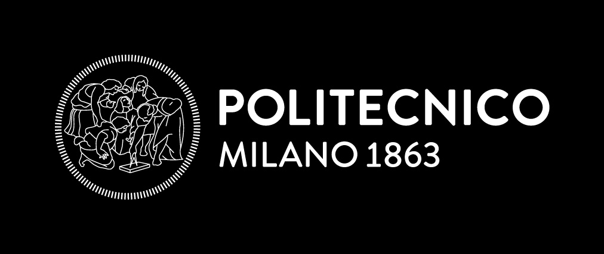

# 🚴Best Bike Paths
> RDD project for the second part of [SWE2 exam](https://www11.ceda.polimi.it/schedaincarico/schedaincarico/controller/scheda_pubblica/SchedaPublic.do?&evn_default=evento&c_classe=863416&__pj0=0&__pj1=1e19b7ddf83e98c205ae2c3737d648c1) - A.Y. 2025/2026.

**👤 Professor**: Matteo Rossi

**🎓 Evaluation**: 13.4/14
  
---

### 🎯Scope
The project goal is the creation of an immaginary platform _Best Bike Paths_ acting as cycling path inventory and activity monitor for cyclists.

---
### 📂 Project Artifacts

Full assiginment can be found [here](docs/Assignment%20RDD%20AY%202025-2026.pdf).

All final artifacts can be found in the [DeliveryFolder](DeliveryFolder/).
| Artifact | Description | Format |
| :--- | :--- | :--- |
| **RAS** | *Requirements Analysis Specification* - Use cases, functional/non-functional requirements, and Alloy models. | PDF |
| **DD** | *Design Document* - Software architecture, component descriptions and interfaces, deplplyment specifications. | PDF |